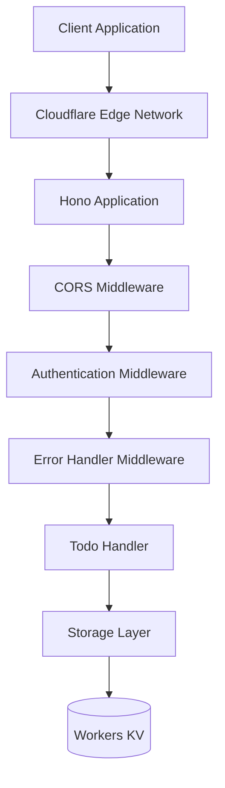
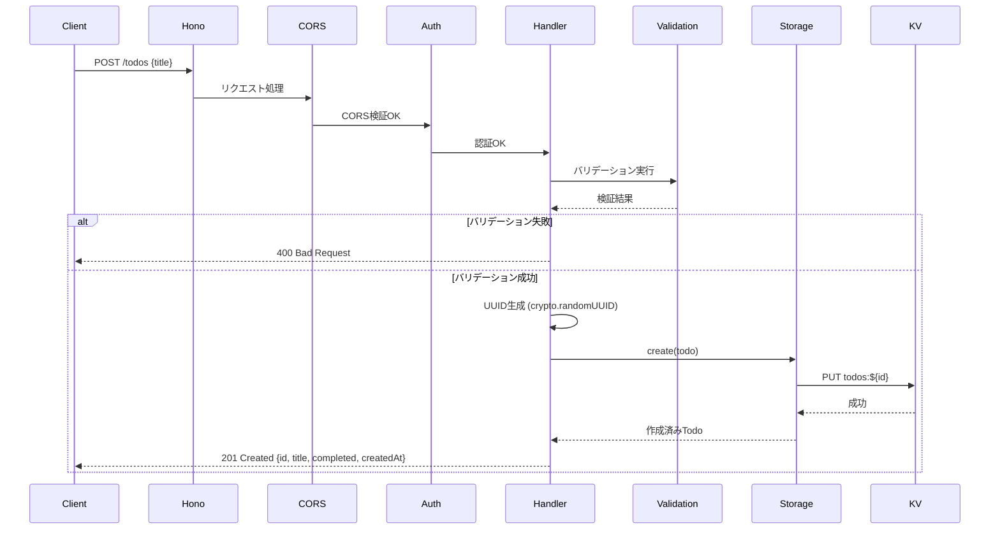
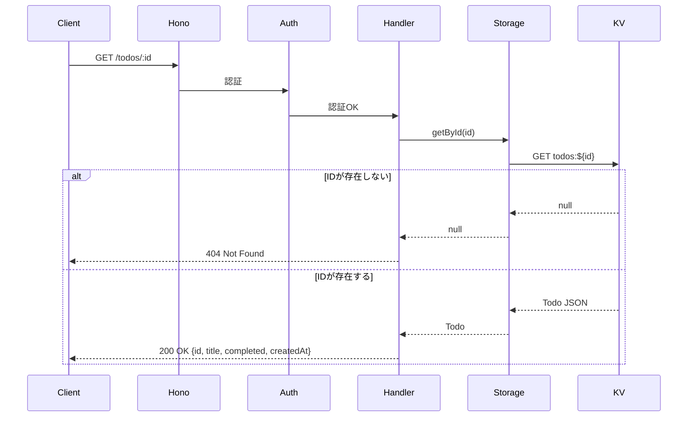
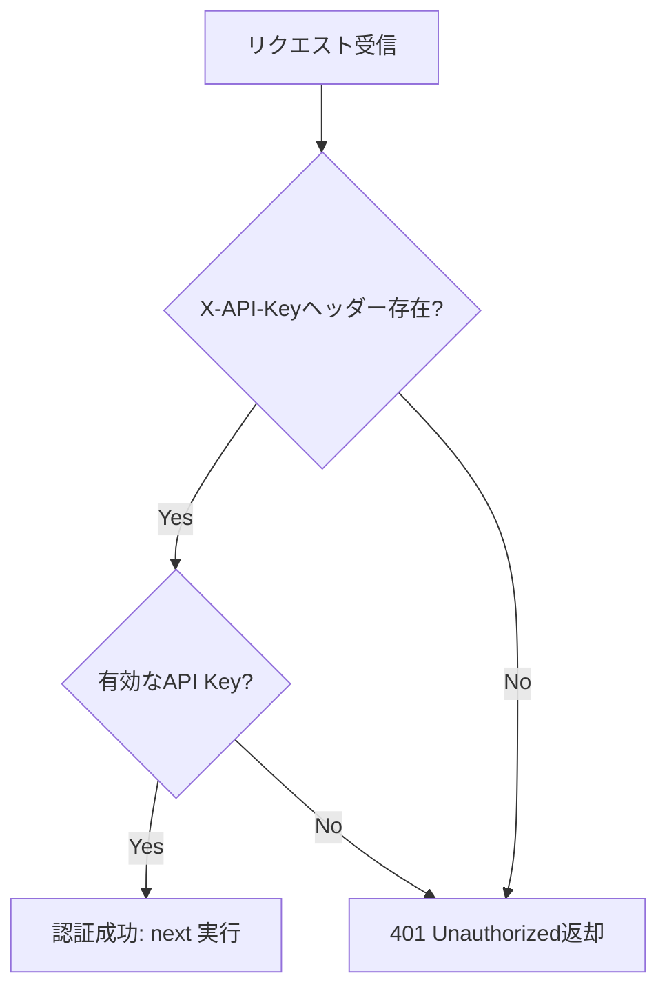
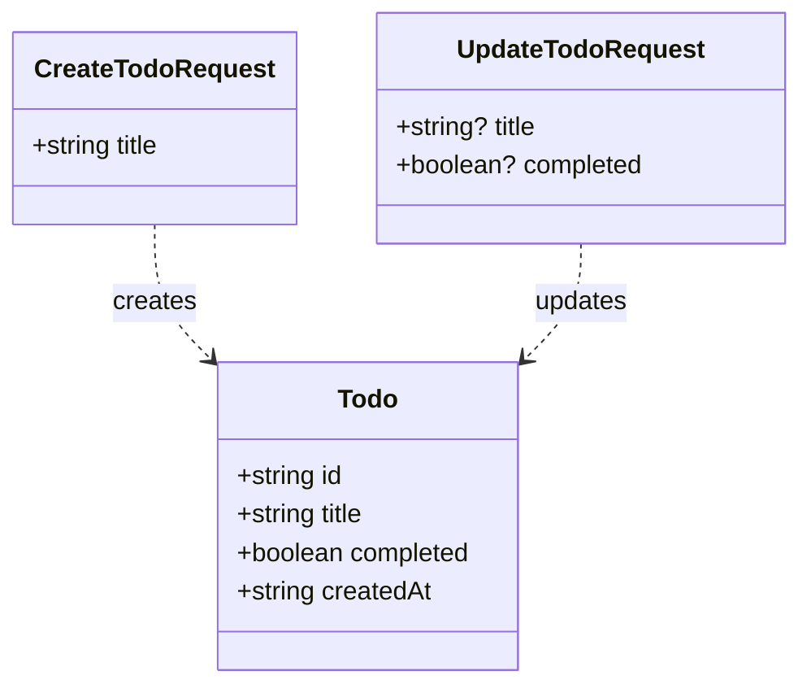
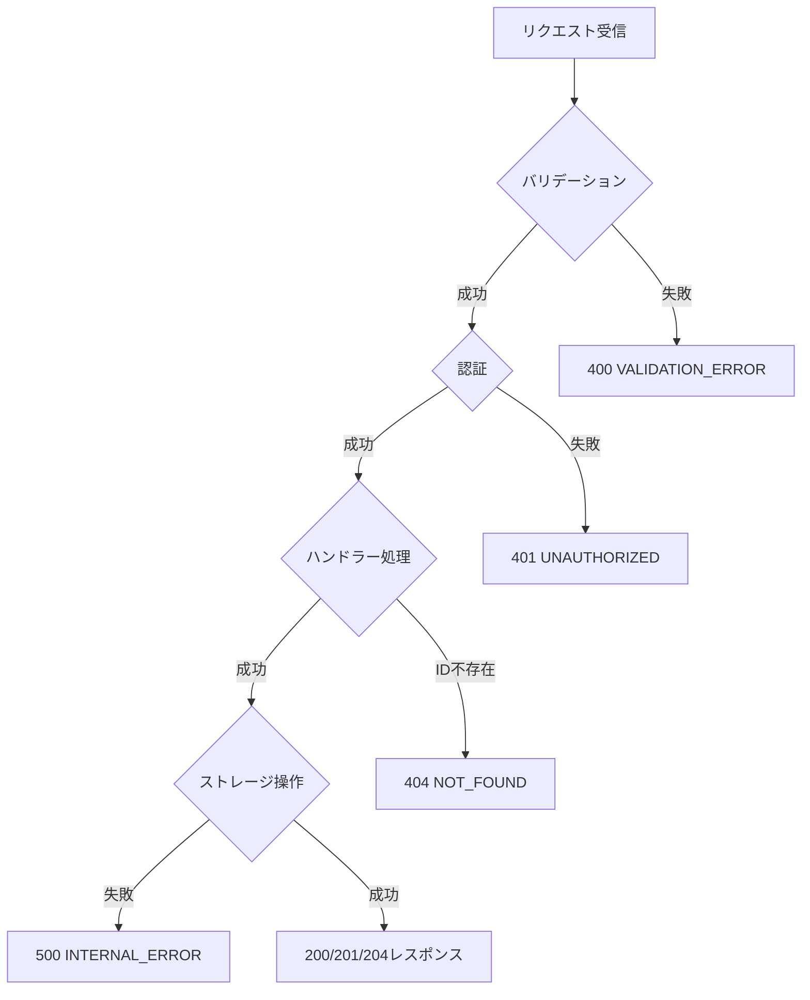

# 技術設計書

## Overview

**目的**: Cloudflare Workersのエッジコンピューティング環境で動作する、高速で軽量なTodo管理RESTful APIを提供する。グローバルに分散されたCloudflareネットワークを活用し、世界中のユーザーに低レイテンシーで高可用性のサービスを実現する。

**ユーザー**: 個人ユーザーが日常のタスク管理に利用する。また、モバイルアプリやWebアプリケーション開発者がバックエンドAPIとして統合する。

**影響**: これは新規システムの構築であり、既存のシステムへの影響はない。Cloudflare Workersプラットフォーム上に完全に新しいサービスを展開する。

### Goals

- Cloudflare Workers上でRESTful APIを提供し、Todo項目のCRUD操作を実現する
- Workers KVを使用してデータを永続化し、Worker再起動後もデータを保持する
- Cloudflare Access + API Keyによる認証・認可を実装し、不正アクセスを防止する
- エッジ処理50ms未満（P95）、ストレージアクセス込み200ms未満（P95）のレスポンスタイムを達成する
- 入力検証とエラーハンドリングを適切に実装し、セキュリティと安定性を確保する
- 最大500件のTodo項目をサポート（Workers KV List API制限1000件に対して余裕を確保）

### Non-Goals

- リアルタイム同期機能（WebSocket）は現フェーズでは実装しない（将来的な拡張として検討）
- チーム共有機能やマルチユーザー管理は含まれない
- 複雑なクエリ機能（タグ検索、期限フィルター等）は将来の拡張として位置付ける

### Scope Changes (MVP実装中)

**追加実装された機能:**
- ✅ **フロントエンドUI** - 当初は範囲外でしたが、MVP完成時に追加実装されました
  - React 18によるSPA（CDN経由）
  - シンプルなTodo管理UI
  - ブラウザアクセス時にルートパス (/) でフロントエンドを提供
  - API Key入力による認証
  - リアルタイムのCRUD操作

## Architecture

### High-Level Architecture



**アーキテクチャの特徴**:

- **エッジファーストアプローチ**: Cloudflareの300+エッジロケーションで処理を実行し、ユーザーに最も近い場所でレスポンスを生成
- **ミドルウェアチェーン**: Honoのミドルウェアアーキテクチャを活用し、CORS、認証、エラーハンドリングを段階的に処理
- **レイヤー分離**: エントリーポイント、ハンドラー、ストレージの明確な分離により、テスタビリティと保守性を確保
- **ストレージ抽象化**: IStorageインターフェースを通じて、将来的なストレージ移行（D1、Durable Objects等）を容易にする

**ステアリング準拠**:
- structure.mdで定義されたレイヤードアーキテクチャパターンに従う
- tech.mdで選定されたHono + Workers KVの技術スタックを採用
- product.mdの価値提案（高速レスポンス、高可用性、シンプルなAPI）を実現

### Technology Stack and Design Decisions

#### Technology Stack

**Runtime Environment**
- **選定**: Cloudflare Workers（V8 isolates）
- **理由**: エッジコンピューティングによる低レイテンシー、自動スケーリング、サーバーレスによる運用負荷の最小化
- **代替案**: AWS Lambda@Edge（Cloudflareに比べてエッジロケーション数が少ない）、Vercel Edge Functions（Workers KVに相当するストレージが制限的）

**Web Framework**
- **選定**: Hono v4.x
- **理由**: Cloudflare Workers向けに最適化された軽量設計（~12KB）、TypeScript完全サポート、直感的なルーティングAPI、Fetch API準拠
- **代替案**: itty-router（ミドルウェアサポートが限定的）、素のFetch API（ルーティングとミドルウェアを自前実装する必要がある）

**Data Storage**
- **選定**: Cloudflare Workers KV
- **理由**: Key-Value形式でシンプルな実装、読み込み高速（10-50ms）、無料枠が大きい（100,000 read/日、1,000 write/日）、エッジ最適化
- **代替案**: D1（リレーショナルデータが不要）、Durable Objects（強い一貫性が不要、コストが高い）

**Programming Language**
- **選定**: TypeScript
- **理由**: 型安全性による品質向上、IDE補完によるDX向上、Cloudflare Workersのネイティブサポート
- **代替案**: JavaScript（型安全性の欠如によるバグリスク）

**Authentication**
- **選定**: Cloudflare Access（ブラウザ用） + API Key（プログラマティックアクセス用）
- **理由**: 実装コストゼロ（Cloudflare Access）、シンプルな実装（API Key）、OAuth2/OIDCへの将来的な移行が容易
- **代替案**: JWT（実装コストが高い）、Basic認証（セキュリティが弱い）

#### Key Design Decisions

**決定1: Workers KVをストレージとして選定**

- **コンテキスト**: Todo項目を永続化するストレージが必要。Cloudflareは3つのオプション（KV、D1、Durable Objects）を提供している。
- **代替案**:
  - D1: SQLiteベースのリレーショナルデータベース、複雑なクエリに対応
  - Durable Objects: 強い一貫性を提供、ステートフルなアプリケーションに最適
  - Workers KV: Key-Valueストア、グローバル分散、読み込み高速
- **選定アプローチ**: Workers KV
- **理由**:
  - Todoアプリケーションは単純なCRUD操作のみで、複雑なクエリやJOINが不要
  - eventual consistencyで十分（数秒の遅延は許容可能）
  - 読み込みパフォーマンス（10-50ms）がパフォーマンス要件（< 50ms P95）を満たす
  - 無料枠（100,000 read/日、1,000 write/日）が十分
  - 実装がシンプル（Key-Value形式）
- **トレードオフ**:
  - 獲得: 実装の簡潔性、読み込み高速性、無料枠の大きさ、グローバル分散
  - 犠牲: 強い一貫性（eventual consistency）、複雑なクエリ機能、書き込み制限（1,000/日）

**決定2: Honoフレームワークの採用**

- **コンテキスト**: Cloudflare Workers上でRESTful APIを構築するためのWebフレームワークが必要。素のFetch APIでも実装可能だが、ルーティングとミドルウェアの実装が複雑になる。
- **代替案**:
  - 素のFetch API: 依存関係ゼロ、完全なコントロール
  - itty-router: 軽量（~1KB）、基本的なルーティングのみ
  - Hono: 軽量（~12KB）、ミドルウェアサポート、TypeScript完全サポート
- **選定アプローチ**: Hono
- **理由**:
  - Cloudflare Workersでのパフォーマンスが実証済み
  - ミドルウェアチェーン（CORS、認証、エラーハンドリング）により、横断的関心事を分離
  - 型安全なルーティングとバリデーション
  - Express風のシンプルなAPI設計で学習コストが低い
  - 組み込みCORSサポート、JSONレスポンスヘルパー
- **トレードオフ**:
  - 獲得: 開発効率の向上、コードの可読性、保守性、ミドルウェアによる横断的関心事の分離
  - 犠牲: バンドルサイズの増加（~12KB）、フレームワークへの依存

**決定3: レイヤードアーキテクチャパターンの採用**

- **コンテキスト**: コードを適切に構造化し、テスタビリティと保守性を確保する必要がある。
- **代替案**:
  - モノリシックな単一ファイル: 実装が最も簡単
  - MVC（Model-View-Controller）: Webアプリケーションで一般的
  - レイヤードアーキテクチャ: ビジネスロジックとインフラストラクチャを分離
- **選定アプローチ**: レイヤードアーキテクチャ（エントリーポイント → ハンドラー → ストレージ）
- **理由**:
  - 各レイヤーが明確な責任を持ち、単一責任原則に従う
  - ストレージ層を抽象化することで、将来的なストレージ移行（D1、Durable Objects）が容易
  - ユニットテストが容易（各レイヤーを独立してテスト可能）
  - structure.mdで定義されたアーキテクチャパターンに準拠
- **トレードオフ**:
  - 獲得: テスタビリティ、保守性、将来的な拡張性、ストレージ移行の容易さ
  - 犠牲: ファイル数の増加、初期実装の複雑さ

## System Flows

### Todo作成フロー



### Todo取得フロー（単一項目）



### 認証フロー



## Requirements Traceability

| 要件 | 要件概要 | コンポーネント | インターフェース | フロー |
|------|---------|--------------|----------------|--------|
| 1 | Todo項目の作成 | TodoHandler, ValidationUtility, StorageLayer | POST /todos, create() | Todo作成フロー |
| 2 | Todo項目の取得 | TodoHandler, StorageLayer | GET /todos, GET /todos/:id, getAll(), getById() | Todo取得フロー |
| 3 | Todo項目の更新 | TodoHandler, ValidationUtility, StorageLayer | PUT /todos/:id, update() | - |
| 4 | Todo項目の削除 | TodoHandler, StorageLayer | DELETE /todos/:id, delete() | - |
| 5 | データ永続化 | StorageLayer, Workers KV | IStorage interface, KV API | - |
| 6 | RESTful API | HonoApplication (index.ts) | POST/GET/PUT/DELETE /todos | 全フロー |
| 7 | エラーハンドリング | ErrorHandlerMiddleware, ResponseUtility | errorResponse(), onError() | エラーハンドリングフロー |
| 8 | パフォーマンス | Cloudflare Workers, Workers KV | - | - |
| 9 | CORS | CORSMiddleware | OPTIONS /*, CORS headers | - |
| 10 | 認証・認可 | AuthenticationMiddleware | X-API-Key header, apiKeyAuth() | 認証フロー |
| 11 | DoS保護 | Cloudflare Bot Management, 無料枠制限 | - | - |
| 12 | データバリデーション | ValidationUtility | validateTodoInput(), validateId() | Todo作成フロー |
| 13 | ID生成 | TodoHandler (crypto.randomUUID) | crypto.randomUUID() | Todo作成フロー |
| 14 | エラーレスポンス標準化 | ResponseUtility | errorResponse() | エラーハンドリングフロー |

## Components and Interfaces

### エントリーポイント層

#### Hono Application (index.ts)

**Responsibility & Boundaries**
- **主要責任**: Honoアプリケーションの初期化、ルーティング定義、ミドルウェアチェーン構成、HTTPリクエストの受信と振り分け
- **ドメイン境界**: アプリケーションのエントリーポイント、HTTP層
- **データ所有権**: なし（リクエスト/レスポンスの転送のみ）
- **トランザクション境界**: なし（ミドルウェアとハンドラーに委譲）

**Dependencies**
- **インバウンド**: HTTPクライアント（ブラウザ、モバイルアプリ、curl等）
- **アウトバウンド**: CORSミドルウェア、Authenticationミドルウェア、ErrorHandlerミドルウェア、TodoHandler
- **外部**: Hono（npm package）

**外部依存関係の調査**:
- **Hono**: Cloudflare Workers向けの軽量Webフレームワーク
  - バージョン: v4.x（最新の安定版を使用）
  - 主要API: `new Hono()`, `app.get()`, `app.post()`, `app.put()`, `app.delete()`, `app.use()`, `app.onError()`
  - Cloudflare Workers Bindingsへのアクセス: `c.env.BINDING_NAME`
  - コンテキストオブジェクト: `c.req`, `c.json()`, `c.text()`
  - ミドルウェアチェーン: `app.use(middleware)` で順次実行
  - エラーハンドリング: `app.onError((err, c) => { ... })`

**API Contract**

| Method | Endpoint | Request | Response | Errors |
|--------|----------|---------|----------|--------|
| POST | /todos | `{"title": string}` | `{"id": string, "title": string, "completed": boolean, "createdAt": string}` | 400, 401, 500 |
| GET | /todos | - | `[{"id": string, "title": string, "completed": boolean, "createdAt": string}]` | 401, 500 |
| GET | /todos/:id | - | `{"id": string, "title": string, "completed": boolean, "createdAt": string}` | 401, 404, 500 |
| PUT | /todos/:id | `{"title"?: string, "completed"?: boolean}` | `{"id": string, "title": string, "completed": boolean, "createdAt": string}` | 400, 401, 404, 500 |
| DELETE | /todos/:id | - | `204 No Content` | 401, 404, 500 |
| OPTIONS | /* | - | CORS headers | - |

**リクエストスキーマ**:

```typescript
// POST /todos
interface CreateTodoRequest {
  title: string; // 必須、1-500文字、制御文字不可
}

// PUT /todos/:id
interface UpdateTodoRequest {
  title?: string; // 任意、1-500文字、制御文字不可
  completed?: boolean; // 任意、真偽値のみ
}
```

**レスポンススキーマ**:

```typescript
interface TodoResponse {
  id: string; // UUID v4形式
  title: string;
  completed: boolean;
  createdAt: string; // ISO 8601形式
}

interface ErrorResponse {
  error: {
    code: string; // ERROR_CODE形式
    message: string;
  };
}
```

### ハンドラー層

#### Todo Handler (handlers/todos.ts)

**Responsibility & Boundaries**
- **主要責任**: Todo項目のCRUD操作のビジネスロジック実装、バリデーション、UUID生成、レスポンス生成
- **ドメイン境界**: Todoドメイン
- **データ所有権**: Todoエンティティの生成と変換（永続化はStorageLayerに委譲）
- **トランザクション境界**: 単一Todo操作（作成、更新、削除）

**Dependencies**
- **インバウンド**: Hono Application（index.ts）
- **アウトバウンド**: StorageLayer（IStorage interface）、ValidationUtility、ResponseUtility
- **外部**: crypto.randomUUID()（Web Crypto API）

**外部依存関係の調査**:
- **crypto.randomUUID()**: Web Crypto APIの一部、Cloudflare Workersで完全サポート
  - 機能: v4 UUIDを暗号学的に安全な乱数生成器で生成
  - 使用方法: `const id = crypto.randomUUID();`
  - パフォーマンス: 同期的に実行、非常に高速（< 1ms）
  - セキュリティ: 暗号学的に安全、予測不可能

**Service Interface**:

```typescript
interface TodoHandlerService {
  createTodo(c: Context): Promise<Response>;
  // 事前条件:
  //   - リクエストボディに有効なtitleが含まれる
  //   - 現在のTodo件数が500件未満である
  // 事後条件: 新しいTodo項目が作成され、201 Createdレスポンスが返される
  // 不変条件: idはUUID v4形式、completedはfalse、createdAtは現在時刻

  getTodos(c: Context): Promise<Response>;
  // 事前条件: 認証済みリクエスト
  // 事後条件: すべてのTodo項目が配列として返される（空の場合は[]）
  // 不変条件: 各Todo項目は完全なスキーマを持つ

  getTodoById(c: Context): Promise<Response>;
  // 事前条件: パスパラメータに有効なUUID v4形式のidが含まれる
  // 事後条件: 該当するTodo項目が返される、または404エラー
  // 不変条件: 存在する場合、完全なスキーマを持つTodo項目が返される

  updateTodo(c: Context): Promise<Response>;
  // 事前条件: パスパラメータに有効なid、リクエストボディに更新データ
  // 事後条件: Todo項目が更新され、更新後のデータが返される、または404エラー
  // 不変条件: id、createdAtは変更されない

  deleteTodo(c: Context): Promise<Response>;
  // 事前条件: パスパラメータに有効なid
  // 事後条件: Todo項目が削除され、204 No Contentが返される、または404エラー
  // 不変条件: 削除後、該当idのTodo項目は取得不可
}
```

### ミドルウェア層

#### Authentication Middleware (middleware/auth.ts)

**Responsibility & Boundaries**
- **主要責任**: リクエストの認証・認可、X-API-Keyヘッダーの検証、未認証リクエストのブロック
- **ドメイン境界**: セキュリティ、認証
- **データ所有権**: なし（検証のみ）
- **トランザクション境界**: なし

**Dependencies**
- **インバウンド**: Hono Application（index.ts）
- **アウトバウンド**: なし
- **外部**: Cloudflare Workers環境変数（`c.env.VALID_API_KEYS`）

**Service Interface**:

```typescript
interface AuthMiddleware {
  apiKeyAuth(c: Context, next: Next): Promise<Response | void>;
  // 事前条件: リクエストにX-API-Keyヘッダーが含まれる
  // 事後条件: 有効なAPI Keyの場合はnext()実行、無効な場合は401エラー
  // 不変条件: 環境変数VALID_API_KEYSに登録されたキーのみ許可
}
```

**環境変数**:
- `VALID_API_KEYS`: カンマ区切りの有効なAPI Keyリスト（例: `"key1,key2,key3"`）

#### CORS Middleware

**Responsibility & Boundaries**
- **主要責任**: CORSヘッダーの付与、プリフライトリクエスト（OPTIONS）の処理、クロスオリジンアクセスの許可
- **ドメイン境界**: セキュリティ、HTTP
- **データ所有権**: なし
- **トランザクション境界**: なし

**Dependencies**
- **インバウンド**: Hono Application（index.ts）
- **アウトバウンド**: なし
- **外部**: Hono CORS middleware（`hono/cors`）

**Service Interface**:

```typescript
import { cors } from 'hono/cors';

// 設定例
app.use('/*', cors({
  origin: '*', // または特定のオリジンを指定
  allowMethods: ['GET', 'POST', 'PUT', 'DELETE', 'OPTIONS'],
  allowHeaders: ['Content-Type', 'X-API-Key'],
}));
```

**環境別CORS設定**:

開発環境と本番環境で異なるCORS設定を使用します。

```typescript
import { cors } from 'hono/cors';

// 環境変数から許可オリジンを取得（未設定時は '*'）
const getAllowedOrigins = (c: Context): string | string[] => {
  const origins = c.env.ALLOWED_ORIGINS;
  return origins ? origins.split(',').map(o => o.trim()) : '*';
};

app.use('/*', async (c, next) => {
  const allowedOrigins = getAllowedOrigins(c);

  return cors({
    origin: allowedOrigins,
    allowMethods: ['GET', 'POST', 'PUT', 'DELETE', 'OPTIONS'],
    allowHeaders: ['Content-Type', 'X-API-Key'],
  })(c, next);
});
```

**環境変数**:
- `ALLOWED_ORIGINS`: カンマ区切りの許可オリジンリスト
  - 例: `"https://todo.example.com,https://app.example.com"`
  - 未設定時: `'*'`（開発環境用）

**セキュリティ上の注意**:
- 本番環境では必ず `ALLOWED_ORIGINS` を設定し、`'*'` を避けてください
- クレデンシャル（API Key）を含むリクエストで `origin: '*'` を使用すると、CSRFリスクが増大します

#### Error Handler Middleware

**Responsibility & Boundaries**
- **主要責任**: 予期しないエラーのキャッチ、標準化されたエラーレスポンスの生成、エラーログの記録
- **ドメイン境界**: エラーハンドリング
- **データ所有権**: なし
- **トランザクション境界**: なし

**Dependencies**
- **インバウンド**: Hono Application（index.ts）
- **アウトバウンド**: ResponseUtility
- **外部**: なし

**Service Interface**:

```typescript
interface ErrorHandler {
  onError(err: Error, c: Context): Response;
  // 事前条件: エラーが発生している
  // 事後条件: 標準化されたエラーレスポンスが返される
  // 不変条件: エラー詳細はログに記録される（スタックトレースはクライアントに公開されない）
}
```

### ストレージ層

#### Storage Layer (storage/interface.ts, storage/kv.ts)

**Responsibility & Boundaries**
- **主要責任**: Todo項目の永続化、Workers KVへのアクセス抽象化、CRUD操作の実装
- **ドメイン境界**: データ永続化
- **データ所有権**: Workers KVに保存されたTodo項目の読み書き
- **トランザクション境界**: 単一KV操作（eventual consistency）

**Dependencies**
- **インバウンド**: TodoHandler
- **アウトバウンド**: Workers KV Binding
- **外部**: Cloudflare Workers KV（`c.env.TODO_KV`）

**Service Interface**:

```typescript
interface IStorage {
  create(todo: Todo): Promise<Todo>;
  // 事前条件: todo.idが一意である
  // 事後条件: Todoがストレージに保存される
  // 不変条件: idは変更されない

  getAll(): Promise<Todo[]>;
  // 事前条件: なし
  // 事後条件: すべてのTodo項目が配列として返される
  // 不変条件: 配列は空または有効なTodo項目を含む

  getById(id: string): Promise<Todo | null>;
  // 事前条件: idがUUID v4形式である
  // 事後条件: 該当するTodoが返される、または存在しない場合はnull
  // 不変条件: 返されるTodoは完全なスキーマを持つ

  update(id: string, updates: Partial<Todo>): Promise<Todo | null>;
  // 事前条件: idが存在し、updatesが有効なフィールドを含む
  // 事後条件: Todoが更新される、または存在しない場合はnull
  // 不変条件: id、createdAtは変更されない

  delete(id: string): Promise<boolean>;
  // 事前条件: idがUUID v4形式である
  // 事後条件: Todoが削除される（成功時true、存在しない場合false）
  // 不変条件: 削除後、該当idのTodoは取得不可
}
```

**Workers KV実装詳細**:

```typescript
class KVStorage implements IStorage {
  constructor(private kv: KVNamespace) {}

  // KVキー設計:
  // - `todos:${uuid}` - 個別のTodo項目
  // - KV List APIで `todos:` プレフィックスを持つすべてのキーを取得

  async create(todo: Todo): Promise<Todo> {
    // todos:all への書き込みが不要になり、競合状態を完全回避
    await this.kv.put(`todos:${todo.id}`, JSON.stringify(todo));
    return todo;
  }

  async getAll(): Promise<Todo[]> {
    // KV List APIを使用して、todos: プレフィックスを持つすべてのキーを取得
    const list = await this.kv.list({ prefix: 'todos:' });
    const ids = list.keys.map(key => key.name.replace('todos:', ''));

    // 並行してすべてのTodoを取得（パフォーマンス最適化）
    const todosJson = await Promise.all(
      ids.map(id => this.kv.get(`todos:${id}`))
    );

    return todosJson
      .filter(json => json !== null)
      .map(json => JSON.parse(json as string));
  }

  async delete(id: string): Promise<boolean> {
    const existing = await this.getById(id);
    if (!existing) return false;

    // todos:all の更新が不要
    await this.kv.delete(`todos:${id}`);
    return true;
  }
}
```

**Eventual Consistency考慮**:
- Workers KVは最終的整合性（eventual consistency）を提供
- 書き込み後、グローバルに反映されるまで最大60秒かかる可能性がある
- Todoアプリケーションでは許容可能（ユーザー体験への影響は最小限）
- 同一エッジロケーションでは通常、数秒以内に反映される

### ユーティリティ層

#### Validation Utility (utils/validation.ts)

**Responsibility & Boundaries**
- **主要責任**: リクエストデータのバリデーション、入力サニタイゼーション、バリデーションエラーの生成
- **ドメイン境界**: データ検証
- **データ所有権**: なし（検証のみ）
- **トランザクション境界**: なし

**Dependencies**
- **インバウンド**: TodoHandler
- **アウトバウンド**: なし
- **外部**: なし

**Service Interface**:

```typescript
interface ValidationUtility {
  validateTodoInput(input: unknown): { valid: boolean; error?: string };
  // 検証項目:
  // - titleが文字列型である
  // - titleが1-500文字である
  // - titleに制御文字が含まれていない
  // - completedが真偽値である（存在する場合）

  validateId(id: string): boolean;
  // 検証項目:
  // - idがUUID v4形式である

  validateTodoCount(currentCount: number): { valid: boolean; error?: string };
  // 検証項目:
  // - 現在のTodo件数が500件未満である
  // - 500件に達している場合は "TODO_LIMIT_REACHED" エラー
}
```

**バリデーションルール**:
- **title**: 必須、string型、1-500文字、制御文字（\x00-\x1F、\x7F）不可
- **completed**: 任意、boolean型のみ
- **id**: UUID v4形式（正規表現: `/^[0-9a-f]{8}-[0-9a-f]{4}-4[0-9a-f]{3}-[89ab][0-9a-f]{3}-[0-9a-f]{12}$/i`）

#### Response Utility (utils/response.ts)

**Responsibility & Boundaries**
- **主要責任**: 標準化されたJSONレスポンスの生成、CORSヘッダーの付与、エラーレスポンスの生成
- **ドメイン境界**: HTTP レスポンス
- **データ所有権**: なし
- **トランザクション境界**: なし

**Dependencies**
- **インバウンド**: TodoHandler、ErrorHandlerMiddleware
- **アウトバウンド**: なし
- **外部**: なし

**Service Interface**:

```typescript
interface ResponseUtility {
  jsonResponse<T>(data: T, status: number): Response;
  // 標準的なJSONレスポンスを生成
  // Content-Type: application/json
  // 適切なステータスコード

  errorResponse(code: string, message: string, status: number): Response;
  // 標準化されたエラーレスポンスを生成
  // 形式: { error: { code: string, message: string } }
}
```

**エラーコード定義**:
- `VALIDATION_ERROR`: バリデーションエラー（400）
- `UNAUTHORIZED`: 認証エラー（401）
- `NOT_FOUND`: リソースが見つからない（404）
- `TODO_LIMIT_REACHED`: Todo項目数の上限到達（400）
- `INTERNAL_ERROR`: 内部エラー（500）

## Data Models

### Domain Model

**Core Concepts**:

**Todo Entity**
- **説明**: Todoアプリケーションの中心的なエンティティ。タスクを表現し、一意のIDと完了状態を持つ。
- **ライフサイクル**: 作成 → 更新（任意） → 削除
- **一意性**: id（UUID v4）で識別される

**Value Objects**:
- **TodoTitle**: 1-500文字の文字列、制御文字不可
- **TodoCompleted**: 真偽値、デフォルトはfalse
- **TodoCreatedAt**: ISO 8601形式のタイムスタンプ

**Business Rules & Invariants**:
- Todo項目は一意のIDを持たなければならない（UUID v4形式）
- titleは1-500文字の範囲内でなければならない
- titleに制御文字が含まれてはならない
- completedは真偽値でなければならない
- createdAtは作成時に設定され、以降変更されない
- idとcreatedAtは更新操作で変更してはならない



### Physical Data Model (Workers KV)

**Key Design Pattern**:

| Key | Value Type | Description | TTL |
|-----|------------|-------------|-----|
| `todos:${uuid}` | JSON (Todo) | 個別のTodo項目 | なし（永続） |

**Value Structure**:

```typescript
// todos:${uuid}の値
{
  "id": "550e8400-e29b-41d4-a716-446655440000",
  "title": "買い物リストを作成する",
  "completed": false,
  "createdAt": "2025-10-27T10:30:00.000Z"
}
```

**Index Strategy**:
- Workers KVはKey-Valueストアのため、セカンダリインデックスは提供されない
- **KV List API**を使用して `todos:` プレフィックスを持つすべてのキーを取得
- 全Todo取得時は、List APIで全キーを取得後、`Promise.all()` で各Todoを並行取得
- **制限**: KV List APIは最大1000件まで取得可能。本アプリケーションは最大500件に制限するため、この制限内に収まる

**Consistency Model**:
- **Eventual Consistency**: 書き込み後、グローバル反映まで最大60秒
- **同一エッジでの一貫性**: 通常、数秒以内に反映
- **トレードオフ**: 強い一貫性は犠牲になるが、読み込みパフォーマンスが大幅に向上

**Storage Operations Performance**:
- **読み込み**: 10-50ms（エッジキャッシュヒット時）
- **書き込み**: 非同期、即座に返却（グローバル反映は別途）
- **削除**: 非同期、即座に返却

### Data Contracts & Integration

**API Data Transfer**:

```typescript
// リクエストスキーマ
interface CreateTodoRequest {
  title: string; // 1-500文字、制御文字不可
}

interface UpdateTodoRequest {
  title?: string; // 1-500文字、制御文字不可（指定時のみ）
  completed?: boolean; // 真偽値のみ（指定時のみ）
}

// レスポンススキーマ
interface TodoResponse {
  id: string; // UUID v4形式
  title: string;
  completed: boolean;
  createdAt: string; // ISO 8601形式（例: "2025-10-27T10:30:00.000Z"）
}

interface ErrorResponse {
  error: {
    code: string; // ERROR_CODE形式（例: "VALIDATION_ERROR"）
    message: string; // 人間が読めるエラーメッセージ
  };
}
```

**Validation Rules**:
- `title`: 必須（作成時）、1-500文字、制御文字（\x00-\x1F、\x7F）不可
- `completed`: 任意、boolean型のみ（それ以外は400エラー）
- `id`: UUID v4形式（パスパラメータ、自動生成）

**Serialization Format**: JSON（`Content-Type: application/json`）

**Eventual Consistency Handling**:
- クライアントは作成/更新直後の取得で、変更が反映されていない可能性を考慮する
- レスポンスで返されたデータをクライアント側でキャッシュし、即座にUIを更新する
- サーバー側では、同一エッジロケーションでのread-after-writeは通常、数秒以内に反映される

## Error Handling

### Error Strategy

**階層的エラーハンドリングアプローチ**:
1. **バリデーションレベル**: ValidationUtilityで入力検証エラーを早期検出
2. **ハンドラーレベル**: TodoHandlerでビジネスロジックエラー（404等）を処理
3. **ミドルウェアレベル**: ErrorHandlerMiddlewareで予期しないエラーをキャッチ
4. **インフラストラクチャレベル**: Workers KVのストレージエラーを処理

**エラーレスポンス標準化**:
すべてのエラーレスポンスは以下の形式に従う：
```json
{
  "error": {
    "code": "ERROR_CODE",
    "message": "人間が読めるエラーメッセージ"
  }
}
```

### Error Categories and Responses

**User Errors (4xx)**:

| エラータイプ | HTTPステータス | エラーコード | 処理方法 |
|-------------|--------------|-------------|---------|
| バリデーションエラー | 400 Bad Request | VALIDATION_ERROR | ValidationUtilityで検証、フィールドレベルのエラーメッセージを提供 |
| 認証エラー | 401 Unauthorized | UNAUTHORIZED | AuthenticationMiddlewareでAPI Key検証、認証ガイダンスを提供 |
| リソース不存在 | 404 Not Found | NOT_FOUND | TodoHandlerでID存在確認、ナビゲーションヘルプを提供 |
| メソッド不許可 | 405 Method Not Allowed | METHOD_NOT_ALLOWED | Honoのルーティングで自動処理 |

**System Errors (5xx)**:

| エラータイプ | HTTPステータス | エラーコード | 処理方法 |
|-------------|--------------|-------------|---------|
| ストレージエラー | 500 Internal Server Error | INTERNAL_ERROR | ErrorHandlerMiddlewareでキャッチ、グレースフルデグラデーション |
| タイムアウト | 500 Internal Server Error | INTERNAL_ERROR | Workers KVタイムアウト（存在する場合）、リトライ推奨 |
| 予期しないエラー | 500 Internal Server Error | INTERNAL_ERROR | ErrorHandlerMiddlewareでキャッチ、詳細ログ記録（クライアントには公開しない） |

**Business Logic Errors (422)**:
現在のスコープでは該当なし（将来的に、Todo項目の依存関係やステート遷移制約が追加された場合に使用）

### Error Handling Flow



### Monitoring

**エラートラッキング**:
- すべてのエラーは`console.error()`でログ記録
- エラーログには以下の情報を含む：
  - タイムスタンプ
  - エラーコード
  - エラーメッセージ
  - スタックトレース（500エラーのみ）
  - リクエストID（将来的に追加）

**ログレベル**:
- `console.log()`: 通常のリクエスト処理（開発環境のみ）
- `console.warn()`: バリデーションエラー、404エラー
- `console.error()`: 500エラー、予期しないエラー

**ヘルスモニタリング**:
- Cloudflare Workersダッシュボードでリクエスト数、エラー率、レスポンスタイムを監視
- 将来的にCloudflare Analyticsと統合してより詳細なメトリクスを取得

## Testing Strategy

### Testing Setup

**テストツールチェーン**:

開発者がローカルおよびCI環境でテストを実行できるよう、以下の環境を準備します。

**依存パッケージ（package.json）**:
```json
{
  "devDependencies": {
    "vitest": "^1.6.0",
    "miniflare": "^3.20240925.0",
    "@cloudflare/workers-types": "^4.20240925.0",
    "typescript": "^5.6.0"
  },
  "scripts": {
    "test": "vitest",
    "test:coverage": "vitest --coverage"
  }
}
```

**Vitest設定（vitest.config.ts）**:
```typescript
import { defineConfig } from 'vitest/config';

export default defineConfig({
  test: {
    environment: 'miniflare',
    environmentOptions: {
      bindings: {
        TODO_KV: 'TODO_KV',
      },
      kvNamespaces: ['TODO_KV'],
    },
  },
});
```

**Miniflare設定（wrangler.tomlで代替可）**:

テスト用の環境変数は `wrangler.toml` の `[env.test]` セクションで定義：

```toml
[env.test]
vars = { VALID_API_KEYS = "test-key-1,test-key-2" }

[[env.test.kv_namespaces]]
binding = "TODO_KV"
id = "test-kv-namespace-id"
```

**CI設定（GitHub Actions例）**:
```yaml
name: Test

on: [push, pull_request]

jobs:
  test:
    runs-on: ubuntu-latest
    steps:
      - uses: actions/checkout@v4
      - uses: actions/setup-node@v4
        with:
          node-version: '20'
      - run: npm ci
      - run: npm test
```

**テストファイル配置**:
- `/test/unit/` - ユニットテスト（handlers, storage, utils）
- `/test/integration/` - 統合テスト（エンドツーエンドAPI呼び出し）
- `/test/e2e/` - E2Eテスト（ステージング環境使用）

### Unit Tests

**対象コンポーネント**: ハンドラー、バリデーション、ストレージ層、ユーティリティ

**主要テストケース**:
1. **ValidationUtility**:
   - タイトル検証（空文字、501文字、制御文字、正常値）
   - ID検証（無効なUUID、UUID v4以外、正常値）
2. **TodoHandler**:
   - createTodo: UUID生成、デフォルト値設定、ストレージ呼び出し
   - getTodoById: 存在するID、存在しないID（null返却）
   - updateTodo: 部分更新、id/createdAt不変性
3. **KVStorage**:
   - create: 個別Todo保存（KV List API使用のため、todos:all更新不要）
   - getAll: KV List APIでキー取得、Promise.allで並行取得
   - getById: KV取得、JSONパース
   - delete: KV削除（KV List API使用のため、todos:all更新不要）
4. **ResponseUtility**:
   - jsonResponse: 正しいContent-Typeとステータスコード
   - errorResponse: 標準化されたエラー形式

**テストフレームワーク**: Vitest（Workers環境対応、高速）

**モック戦略**:
- Workers KV: インメモリモック（Miniflare提供）
- crypto.randomUUID: 固定UUIDを返すモック

### Integration Tests

**対象フロー**: エンドツーエンドのAPI呼び出し、ミドルウェアチェーン、ストレージ統合

**主要テストケース**:
1. **認証フロー**:
   - 有効なAPI Key → 200 OK
   - 無効なAPI Key → 401 Unauthorized
   - API Key欠落 → 401 Unauthorized
2. **CRUD操作フロー**:
   - POST /todos → 201 Created → GET /todos/:id → 200 OK（同一データ）
   - PUT /todos/:id → 200 OK → GET /todos/:id → 更新確認
   - DELETE /todos/:id → 204 No Content → GET /todos/:id → 404 Not Found
3. **エラーハンドリングフロー**:
   - 無効なJSON → 400 Bad Request
   - 存在しないID → 404 Not Found
   - 予期しないエラー → 500 Internal Server Error
4. **CORSフロー**:
   - OPTIONS リクエスト → CORSヘッダー確認
   - クロスオリジンリクエスト → Access-Control-Allow-Origin確認

**テスト環境**: Miniflare（Workers KVを含むローカル環境シミュレーション）

### E2E Tests

**対象**: 実際のCloudflare Workers環境でのAPI動作確認

**主要テストケース**:
1. **Todo作成から削除までの完全フロー**:
   - POST /todos → GET /todos → PUT /todos/:id → DELETE /todos/:id
2. **複数Todo操作**:
   - 複数のTodo作成 → GET /todos（全取得） → 各Todo削除
3. **同時実行**:
   - 並行して複数のTodo作成 → データ整合性確認

**テストツール**: curl、Postman、またはカスタムTypeScriptテストスクリプト

**テスト環境**: Cloudflare Workers ステージング環境

### Performance Tests

**対象メトリクス**: レスポンスタイム、スループット、エッジロケーション分散

**主要テストケース**:
1. **レスポンスタイム**:
   - GET /todos（エッジ処理のみ） → P95 < 50ms
   - GET /todos/:id（KV読み込み込み） → P95 < 200ms
   - POST /todos（KV書き込み込み） → P95 < 200ms
2. **スケーラビリティ**:
   - 100同時リクエスト → エラー率 < 1%
   - 1,000同時リクエスト → エラー率 < 5%
3. **KV Eventual Consistency**:
   - POST /todos → 即座にGET /todos/:id → 成功率測定（同一エッジロケーション）
   - POST /todos → 60秒後にGET /todos/:id（異なるエッジロケーション） → 成功率測定

**テストツール**: Apache Bench (ab)、wrk、またはCloudflare Load Testing

**テスト条件**:
- 複数の地理的ロケーションから実行（米国、欧州、アジア）
- 異なるエッジロケーションでの分散確認

## Security Considerations

### 認証・認可

**2段階認証アプローチ**:

1. **Cloudflare Access（ブラウザアクセス用）**:
   - **対象**: 開発者やエンドユーザーのブラウザアクセス
   - **方式**: Email OTP、Google Login等のOAuth2/OIDC
   - **設定**: Cloudflare Dashboardで設定（コード変更不要）
   - **無料枠**: 最大5ユーザー
   - **メリット**: 実装コストゼロ、OAuth2/OIDCへの将来的な移行が容易、DoS対策も含まれる

2. **固定API Key（プログラマティックアクセス用）**:
   - **対象**: CI/CD、スクリプト、自動化ツール
   - **方式**: HTTPヘッダー `X-API-Key` で認証
   - **設定**: 環境変数 `VALID_API_KEYS` で管理（カンマ区切り）
   - **実装**: AuthenticationMiddleware（middleware/auth.ts）
   - **セキュリティ考慮**:
     - API Keyはクライアント側で安全に保管（環境変数、Secrets Manager）
     - HTTPS必須（Cloudflare WorkersはデフォルトでHTTPS）
     - API Keyのローテーション推奨（定期的に更新）

**将来の拡張**: OAuth2/OIDC対応時も同じヘッダーベース認証パターンを継承可能（`Authorization: Bearer <token>`）

### 入力検証

**バリデーション戦略**:
- **すべてのユーザー入力を検証**: タイトル、完了状態、ID
- **型安全性**: TypeScriptの型システムを活用
- **早期検出**: ValidationUtilityでバリデーションを一元化

**具体的な検証項目**:
1. **タイトル検証**:
   - 長さ: 1-500文字（要件12）
   - 制御文字: \x00-\x1F、\x7F を拒否（要件12）
   - 型: string型のみ
2. **完了状態検証**:
   - 型: boolean型のみ（要件12）
   - デフォルト値: false
3. **ID検証**:
   - 形式: UUID v4形式（要件13）
   - 正規表現: `/^[0-9a-f]{8}-[0-9a-f]{4}-4[0-9a-f]{3}-[89ab][0-9a-f]{3}-[0-9a-f]{12}$/i`
4. **JSON検証**:
   - 不正なJSON形式 → 400 Bad Request（要件7、14）

### DoS保護とレート制限

**3層防御アプローチ**:

1. **レイヤー1: Cloudflare Bot Management（無料）**:
   - 自動ボット検出・ブロック
   - 設定: Cloudflare Dashboard → Security → Bots
   - 効果: 大量の自動リクエストを防止

2. **レイヤー2: Cloudflare Access（無料、最大5ユーザー）**:
   - 認証済みユーザーのみアクセス許可
   - 不正アクセスを根本的に防止
   - ブラウザアクセスに対して有効

3. **レイヤー3: Workers無料枠制限（自動）**:
   - 100,000 req/日の上限（要件11）
   - 超過時に自動停止（予期しないコスト発生を防止）

**将来の拡張（Phase 2）**:
- Cloudflare Rate Limiting Rules: 100 req/分/IP等の詳細な制限
- 有料プランでより柔軟な設定

### データ保護

**データ暗号化**:
- **転送中**: HTTPS（Cloudflare Workersはデフォルトで強制）
- **保存時**: Workers KVは暗号化されて保存（Cloudflareが管理）

**データプライバシー**:
- Todo項目は個人データを含む可能性があるため、適切な認証・認可が必須
- API Keyは環境変数で管理し、コードリポジトリにコミットしない
- ログにAPI Keyやセンシティブデータを含めない

**CORS設定**:
- `origin`: 特定のオリジンのみ許可（本番環境では`*`を避ける）
- `allowMethods`: 必要なメソッドのみ許可（GET, POST, PUT, DELETE, OPTIONS）
- `allowHeaders`: 必要なヘッダーのみ許可（Content-Type, X-API-Key）

### エラー情報の露出制限

**エラーレスポンスのセキュリティ**:
- **詳細なスタックトレースをクライアントに公開しない**: 500エラー時、エラーコード「INTERNAL_ERROR」と一般的なメッセージのみ返却
- **エラー詳細はログに記録**: `console.error()`でサーバー側ログに記録
- **バリデーションエラーは具体的に**: ユーザーが問題を修正できるよう、フィールドレベルのエラーメッセージを提供

## Performance & Scalability

### パフォーマンス目標

**レスポンスタイム目標**:

- **単一Todo取得（GET /todos/:id）**: P95 < 200ms
  - 内訳: KV読み込み（10-50ms） + エッジ処理（20-30ms） + ネットワークレイテンシー（50-100ms）

- **Todo作成（POST /todos）**: P95 < 250ms
  - 内訳: KV書き込み×1（todos:{id}） + エッジ処理（20-30ms） + ネットワークレイテンシー（50-100ms）
  - 注: KV List API採用により、todos:allへの書き込みが不要

- **Todo更新（PUT /todos/:id）**: P95 < 250ms
  - 内訳: KV読み込み + KV書き込み + エッジ処理 + ネットワークレイテンシー

- **Todo削除（DELETE /todos/:id）**: P95 < 200ms
  - 内訳: KV読み込み（存在確認） + KV削除 + エッジ処理 + ネットワークレイテンシー

- **全Todo取得（GET /todos、最大500件）**: P95 < 5秒
  - 内訳: KV List API（50-100ms） + 並行KV読み込み×500（Promise.all使用）
  - エッジキャッシュヒット率が高い場合、実測値はさらに短縮される見込み

- **認証・バリデーション失敗時（エッジ処理のみ）**: P95 < 50ms

**測定方法**:
- Cloudflare Workers Analyticsでレスポンスタイムを監視
- カスタムメトリクス（将来的に）: `console.time()`/`console.timeEnd()`で処理時間を計測

### スケーリングアプローチ

**Cloudflare Workersの自動スケーリング**:
- **水平スケーリング**: リクエスト数に応じて自動的にWorkerインスタンスを増加
- **エッジ分散**: 300+エッジロケーションで処理を分散
- **無制限の同時実行**: Cloudflareプランに応じて無制限（無料プランでは100,000 req/日）

**ストレージスケーリング**:
- **Workers KV**: グローバル分散、自動レプリケーション
- **読み込みスケーラビリティ**: エッジキャッシングにより、読み込みは無制限にスケール
- **書き込み制限**: 無料枠では1,000 write/日（有料プランで拡張可能）

**将来的なスケーラビリティ考慮**:
- **ページネーション**: 大量のTodo項目（1000+）がある場合、全取得APIにページネーションを実装
- **ストレージ移行**: Workers KVのeventual consistencyが問題になる場合、D1またはDurable Objectsに移行

### キャッシング戦略

**Workers KVのエッジキャッシング**:
- **自動キャッシング**: KVの読み込みはエッジでキャッシュされる
- **キャッシュヒット時**: 10-50msで応答
- **キャッシュミス時**: オリジンから取得、若干遅延（100-200ms）

**クライアント側キャッシング**:
- レスポンスヘッダーで`Cache-Control`を設定し、クライアント側でのキャッシングを推奨
- 例: `Cache-Control: public, max-age=60`（1分間キャッシュ）

**キャッシュ無効化**:
- Todo項目の作成/更新/削除時、該当するKVキーのキャッシュは自動的に無効化される

### パフォーマンス最適化

**コード最適化**:
- **バンドルサイズ最小化**: Honoの軽量性（~12KB）を活用、不要な依存関係を避ける
- **起動時間最小化**: V8 isolatesによる高速起動（< 5ms）
- **非同期処理**: すべてのI/O操作（KVアクセス）を非同期で実行

**ストレージ最適化**:
- **バッチ取得**: 全Todo取得時、並行してKV読み込みを実行（`Promise.all()`）
- **JSONシリアライゼーション**: 軽量なJSONフォーマット、不要なフィールドを含めない

**モニタリングとチューニング**:
- Cloudflare Workers Analyticsで継続的にパフォーマンスを監視
- ボトルネックを特定し、必要に応じてストレージ戦略やアーキテクチャを調整

## Deployment & Configuration

### Environment Variables

| 変数名 | 必須 | 説明 | デフォルト値 | 例 |
|--------|------|------|------------|-----|
| `VALID_API_KEYS` | はい | カンマ区切りの有効なAPI Keyリスト | なし | `"key1,key2,key3"` |
| `ALLOWED_ORIGINS` | いいえ | カンマ区切りの許可オリジンリスト | `*`（開発用） | `"https://todo.example.com,https://app.example.com"` |

### Cloudflare Workers Bindings

| Binding名 | タイプ | 説明 |
|-----------|--------|------|
| `TODO_KV` | KV Namespace | Todo項目を保存するKVストレージ |

### wrangler.toml設定例

```toml
name = "cloudflare-workers-todo"
main = "src/index.ts"
compatibility_date = "2025-01-01"

# 開発環境（デフォルト）
[[kv_namespaces]]
binding = "TODO_KV"
id = "your-dev-kv-namespace-id"

[env.production]
# 本番環境
[[env.production.kv_namespaces]]
binding = "TODO_KV"
id = "your-production-kv-namespace-id"

# 本番環境のCORS設定は環境変数で管理
# vars = { ALLOWED_ORIGINS = "https://todo.example.com" }  # 非推奨（シークレット使用推奨）
```

### シークレット管理

**重要**: API Keyや本番環境のオリジンリストは、`wrangler.toml` に平文で記載せず、必ず `wrangler secret` コマンドで管理してください。

```bash
# 本番環境のAPI Key設定
wrangler secret put VALID_API_KEYS --env production
# プロンプト: 複数のキーをカンマ区切りで入力（例: key1,key2,key3）

# 本番環境のCORS設定（オリジンが決まっている場合）
wrangler secret put ALLOWED_ORIGINS --env production
# プロンプト: https://todo.example.com,https://app.example.com

# 開発環境（ローカルテスト用）
wrangler secret put VALID_API_KEYS --env development
```

### デプロイコマンド

```bash
# 開発環境（ステージング）へのデプロイ
wrangler deploy

# 本番環境へのデプロイ
wrangler deploy --env production
```

### KV Namespaceの作成

初回デプロイ前に、KV Namespaceを作成してください：

```bash
# 開発環境用
wrangler kv:namespace create "TODO_KV"
# 出力例: id = "abc123def456"
# → wrangler.toml の [[kv_namespaces]] に設定

# 本番環境用
wrangler kv:namespace create "TODO_KV" --env production
# 出力例: id = "xyz789uvw012"
# → wrangler.toml の [[env.production.kv_namespaces]] に設定
```
