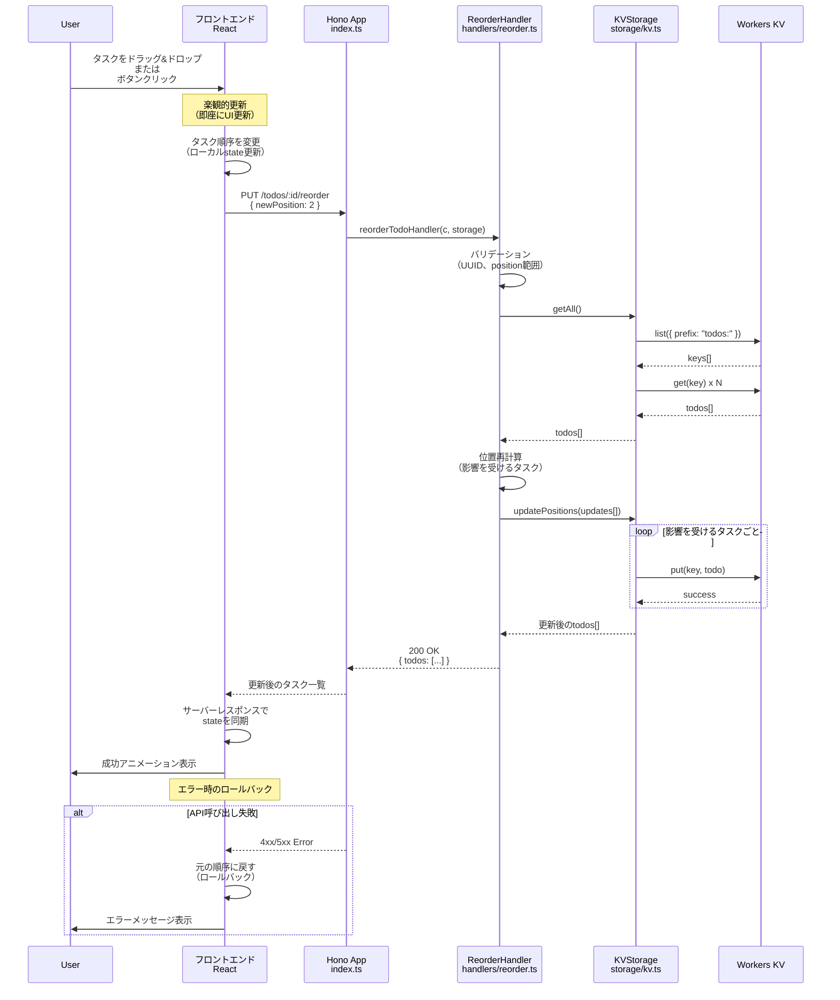
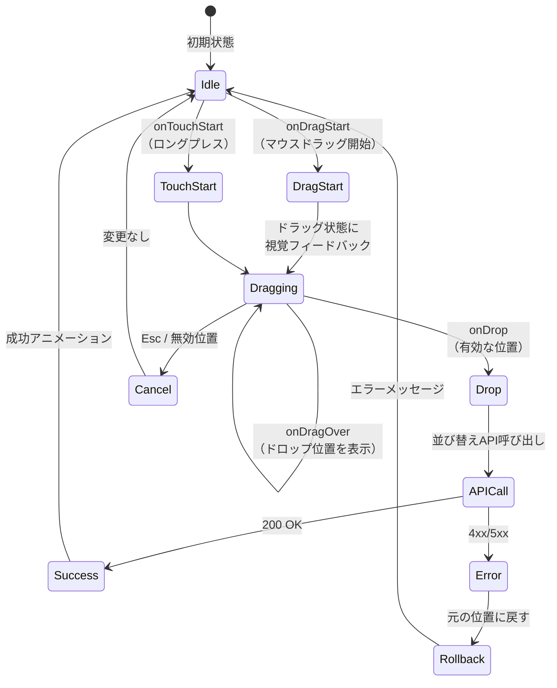
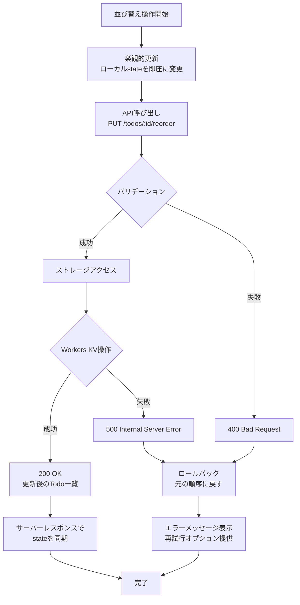
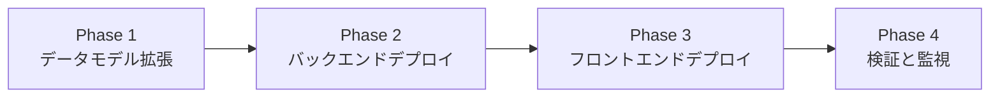

# 技術設計ドキュメント: タスク並び替え機能

## Overview

### 目的

タスク並び替え機能は、既存のTodoアプリケーションに対してユーザー主導の順序管理機能を追加します。ユーザーはドラッグ&ドロップまたはボタン操作でタスクの表示順序を変更し、その順序がバックエンドストレージに永続化されます。この機能により、ユーザーは自身の優先順位や作業フローに合わせてタスクを柔軟に整理できるようになります。

### ユーザー

**プライマリユーザー**: 個人のTodo管理ユーザー
- ドラッグ&ドロップで直感的にタスクを並び替え
- マウス操作が困難な環境ではボタンで順序変更
- キーボードユーザーやスクリーンリーダーユーザーもアクセス可能

### 影響範囲

**既存システムへの変更**:
- Todoデータモデルに`position`フィールドを追加
- ストレージ層に順序インデックス管理ロジックを追加
- 新しい並び替えAPIエンドポイントを追加
- フロントエンドにドラッグ&ドロップUIとボタンUIを追加

**後方互換性**: 既存のTodo項目は自動的に順序インデックスが割り当てられ、既存のCRUD操作は影響を受けません。

### ゴール

- ユーザーがドラッグ&ドロップまたはボタンでタスクの順序を変更できる
- 並び替えた順序がWorkers KVストレージに永続化される
- 100ミリ秒以内のUI更新で即座にフィードバックを提供
- WCAG 2.1 AA基準に準拠したアクセシブルなインターフェース
- 既存のCRUD操作との完全な互換性を維持

### 非ゴール

- 複数タスクの一括移動（将来の拡張として検討）
- タスクのグループ化やカテゴリ分け（別機能）
- リアルタイム同期や競合解決（単一ユーザー前提）
- タスク間の依存関係管理（将来の拡張）

## Architecture

### 既存アーキテクチャ分析

現在のシステムはCloudflare Workers上でHonoフレームワークを使用したRESTful APIとして実装されています。

**既存のレイヤー構成**:
```
エントリーポイント層 (index.ts)
    ↓ Honoミドルウェア（CORS、認証）
ハンドラー層 (handlers/todos.ts)
    ↓ ビジネスロジック
ストレージ層 (storage/kv.ts)
    ↓ Workers KV（key: todos:{uuid}）
モデル層 (models/todo.ts)
```

**既存のTodoモデル**:
- `id`: UUID v4形式
- `title`: 1-500文字
- `completed`: boolean
- `createdAt`: ISO 8601形式

**既存のAPIエンドポイント**:
- `POST /todos` - Todo作成
- `GET /todos` - 全Todo取得
- `GET /todos/:id` - 特定Todo取得
- `PUT /todos/:id` - Todo更新
- `DELETE /todos/:id` - Todo削除

### 統合アーキテクチャ

並び替え機能は既存のレイヤードアーキテクチャに完全に統合されます。

```mermaid
graph TB
    subgraph フロントエンド
        UI[React UI]
        DND[ドラッグ&ドロップ]
        BTN[ボタンコントロール]
        KB[キーボードショートカット]
    end

    subgraph バックエンド
        API[Hono App<br/>index.ts]
        REORDER[ReorderHandler<br/>handlers/reorder.ts]
        STORAGE[KVStorage拡張<br/>storage/kv.ts]
        KV[(Workers KV<br/>todos:{uuid})]
    end

    UI --> DND
    UI --> BTN
    UI --> KB

    DND --> API
    BTN --> API
    KB --> API

    API --> REORDER
    REORDER --> STORAGE
    STORAGE --> KV
```

### アーキテクチャ統合の原則

**保持される既存パターン**:
- Honoルーティングとミドルウェアチェーン
- ハンドラー層でのビジネスロジック分離
- IStorageインターフェースによるストレージ抽象化
- Workers KVのKey-Value形式データ保存

**新規コンポーネントの追加理由**:
- `ReorderHandler`: 並び替えロジックを既存CRUDハンドラーから分離し、単一責任原則を維持
- `position`フィールド: Todoモデルに追加し、順序管理を明示的に表現
- フロントエンド拡張: 既存のReactコンポーネントに並び替えUIを統合

**技術スタック整合性**:
- TypeScript: 型安全性を維持
- Hono: 既存のルーティングパターンに従う
- Workers KV: 既存のストレージ実装を拡張
- React: 既存のフロントエンドに機能追加

**ステアリング準拠**:
- `structure.md`: レイヤードアーキテクチャの原則を維持
- `tech.md`: Hono + Workers KV の技術選択を継続
- `product.md`: シンプルで直感的なUI/UXの提供

## Technology Alignment

### 既存技術スタックとの整合性

タスク並び替え機能は、既存の技術スタックを完全に活用します。新しい外部依存関係の追加は不要です。

**バックエンド（変更なし）**:
- Cloudflare Workers + Hono
- Workers KV
- TypeScript

**フロントエンド（機能追加）**:
- React（既存のCDN版を継続使用）
- Vanilla JavaScriptでドラッグ&ドロップ実装（追加ライブラリ不要）

### 新規依存関係

なし。すべての機能はWeb標準APIとReactの既存機能で実装可能です。

**ドラッグ&ドロップ**:
- HTML5 Drag and Drop API（ブラウザネイティブ）
- Touch Events API（タッチデバイス対応）

**アクセシビリティ**:
- ARIA属性（Web標準）
- Keyboard Events API（Web標準）

### Key Design Decisions

#### 決定1: 順序インデックスの管理方式

**コンテキスト**: タスクの順序を表現する方法を決定する必要がある。

**選択肢**:
1. **整数インデックス（0, 1, 2, ...）**: シンプルだが、並び替え時に多くのタスクの更新が必要
2. **浮動小数点インデックス**: 並び替え時の更新を最小化できるが、精度の問題がある
3. **リンクリスト（prev/next）**: 柔軟だが、クエリが複雑になる

**選択したアプローチ**: **整数インデックス（0, 1, 2, ...）**

並び替え時にposition値を再計算し、影響を受けるすべてのタスクを一括更新します。

**実装**:
```
タスクAを位置2から位置0に移動する場合:
Before: [Task0(pos:0), Task1(pos:1), Task2(pos:2=A), Task3(pos:3)]
After:  [TaskA(pos:0), Task0(pos:1), Task1(pos:2), Task3(pos:3)]
```

**根拠**:
- **シンプルさ**: 実装とデバッグが容易
- **予測可能性**: position値は常に0から始まる連続した整数
- **Workers KV適合**: eventual consistencyで問題なし（Todo管理は秒単位の遅延を許容）
- **パフォーマンス許容**: 最大500件の制約下では再計算コストは十分に低い

**トレードオフ**:
- **得るもの**: シンプルで予測可能な実装、デバッグの容易さ
- **失うもの**: 並び替え時に複数のKV書き込みが発生（ただし500件制限内では許容範囲）

#### 決定2: APIエンドポイント設計

**コンテキスト**: 並び替え操作をどのようなAPIで提供するか。

**選択肢**:
1. `PUT /todos/reorder` - 全タスクの順序を一括更新
2. `PATCH /todos/:id/position` - 特定タスクの位置のみ更新
3. `PUT /todos/:id/reorder` - 特定タスクを新しい位置に移動

**選択したアプローチ**: **`PUT /todos/:id/reorder`**

リクエストボディ: `{ newPosition: number }`

**根拠**:
- **RESTful**: 既存のエンドポイント構造（`/todos/:id`）と一貫性がある
- **最小限のペイロード**: クライアントは新しい位置のみを送信
- **サーバー側で再計算**: 影響を受ける他のタスクの位置はサーバーが自動計算

**トレードオフ**:
- **得るもの**: クライアント実装の簡素化、サーバー側で一貫性を保証
- **失うもの**: クライアント側での完全な制御（ただしTodo管理では不要）

#### 決定3: フロントエンドの状態管理（楽観的更新）

**コンテキスト**: 並び替え操作のUXを最適化するため、楽観的更新を実装する。

**選択したアプローチ**: **楽観的更新 + ロールバック**

1. ユーザーが並び替え操作を実行
2. 即座にUIを更新（100ms以内）
3. バックエンドにリクエスト送信
4. 成功時: そのまま維持
5. 失敗時: 元の状態にロールバックし、エラーメッセージ表示

**根拠**:
- **要件6.1に準拠**: 即座にUI更新を実行
- **UX最適化**: ネットワーク遅延を感じさせない
- **エラーハンドリング**: 失敗時のロールバックで一貫性を保証

**トレードオフ**:
- **得るもの**: スムーズなユーザーエクスペリエンス
- **失うもの**: 実装の複雑さが若干増加（ただし標準的なパターン）

## System Flows

### 並び替えシーケンス図



### ドラッグ&ドロップフロー



## Requirements Traceability

| 要件 | 要件概要 | コンポーネント | インターフェース | フロー |
|------|----------|----------------|------------------|--------|
| 1.1 | 各タスクに順序インデックスを割り当て | TodoModel, KVStorage | position: number | - |
| 1.2 | 新規タスクを最後の位置に配置 | createTodoHandler | create(todo) | - |
| 1.3 | 削除時に順序インデックスを調整 | deleteTodoHandler | delete(id) | - |
| 1.4 | タスク取得時に順序でソート | KVStorage | getAll() | - |
| 2.1-2.5 | ドラッグ&ドロップUI | DragDropComponent | HTML5 DnD API | ドラッグ&ドロップフロー |
| 3.1-3.6 | ボタンによる並び替えUI | ReorderButtons | moveUp/moveDown | - |
| 4.1-4.6 | 並び替えAPI | ReorderHandler | PUT /todos/:id/reorder | 並び替えシーケンス |
| 5.1-5.4 | データ永続化 | KVStorage | updatePositions() | - |
| 6.1-6.6 | UIフィードバック | TodoApp (React) | Optimistic Update | 並び替えシーケンス（エラー分岐） |
| 7.1-7.5 | アクセシビリティ | AccessibleControls | ARIA, Keyboard | - |
| 8.1-8.4 | パフォーマンス | 全コンポーネント | デバウンス、仮想スクロール | - |

## Components and Interfaces

### バックエンド層

#### Todoモデル（拡張）

**責任とドメイン境界**
- **主要な責任**: Todoエンティティの構造定義と順序管理
- **ドメイン境界**: Todo管理ドメイン（既存）
- **データ所有権**: Todo項目のすべてのプロパティ（id, title, completed, createdAt, **position**）
- **トランザクション境界**: 単一のTodo項目（位置変更時は複数Todoを含むトランザクション）

**依存関係**
- **インバウンド**: ハンドラー層、ストレージ層
- **アウトバウンド**: なし（データモデルのみ）
- **外部**: なし

**契約定義**

**データモデル**:
```typescript
// 既存のTodoインターフェースに position フィールドを追加
interface Todo {
  id: string;           // UUID v4形式（既存）
  title: string;        // 1-500文字（既存）
  completed: boolean;   // 完了状態（既存）
  createdAt: string;    // ISO 8601形式（既存）
  position: number;     // NEW: 0から始まる連続した整数
}

// 作成リクエスト（変更なし）
interface CreateTodoRequest {
  title: string;
}

// 並び替えリクエスト（NEW）
interface ReorderTodoRequest {
  newPosition: number;  // 移動先の位置（0以上、タスク総数未満）
}
```

**ビジネスルール**:
- position値は0から始まる連続した整数である
- 新規作成時、positionは現在のタスク総数（=最後の位置）に設定される
- タスク削除時、削除されたタスクより後ろのpositionは-1される
- 並び替え時、移動元と移動先の間のすべてのタスクのpositionが再計算される

**状態管理**
- **状態モデル**: positionは不変ではなく、並び替え操作で変更される
- **永続化**: Workers KVに保存
- **整合性**: eventual consistency（Workers KVの特性）

#### ReorderHandler（新規）

**責任とドメイン境界**
- **主要な責任**: タスクの並び替えロジックを実行
- **ドメイン境界**: Todo順序管理サブドメイン
- **データ所有権**: なし（ストレージ層に委譲）
- **トランザクション境界**: 単一の並び替え操作（複数Todoの位置更新を含む）

**依存関係**
- **インバウンド**: Honoアプリケーション（index.ts）
- **アウトバウンド**: ストレージ層（IStorage）、バリデーション層
- **外部**: なし

**契約定義**

**サービスインターフェース**:
```typescript
/**
 * Reorder Todo Handler
 *
 * 指定されたTodoを新しい位置に移動し、影響を受ける他のTodoの位置を再計算します。
 *
 * @param c - Honoコンテキスト
 * @param storage - ストレージレイヤーインスタンス
 * @returns 更新後の全Todo一覧（200 OK）またはエラーレスポンス
 */
function reorderTodoHandler(
  c: Context<{ Bindings: Env }>,
  storage: IStorage
): Promise<Response>;
```

**事前条件**:
- リクエストにtodoId（UUID v4形式）が含まれる
- リクエストボディにnewPosition（0以上の整数）が含まれる
- 指定されたtodoIdが存在する
- newPositionが有効な範囲（0 ≤ newPosition < タスク総数）である

**事後条件**:
- 指定されたTodoのpositionが新しい位置に更新される
- 影響を受ける他のTodoのpositionが再計算される
- 更新後の全Todo一覧が返される

**不変条件**:
- すべてのTodoのpositionは0から始まる連続した整数である
- 同じposition値を持つTodoは存在しない

**APIコントラクト**:

| Method | Endpoint | Request | Response | Errors |
|--------|----------|---------|----------|--------|
| PUT | /todos/:id/reorder | `{ newPosition: number }` | `Todo[]` (全タスク一覧) | 400, 404, 500 |

**リクエストスキーマ**:
```typescript
{
  newPosition: number  // 0以上、タスク総数未満
}
```

**レスポンススキーマ**（成功時）:
```typescript
Todo[]  // position順にソートされた全タスク一覧
```

**エラーレスポンス**:
- `400 Bad Request`: 無効なUUID形式、newPositionが範囲外、リクエストボディが不正
- `404 Not Found`: 指定されたtodoIdが存在しない
- `500 Internal Server Error`: ストレージエラー

**並び替えアルゴリズム**:
```
入力: todoId, newPosition
1. すべてのTodoを取得し、現在のpositionでソート
2. 移動対象のTodoを特定し、現在の位置（oldPosition）を取得
3. oldPosition == newPosition の場合は何もしない（早期リターン）
4. 影響を受けるTodoの位置を再計算:
   - oldPosition < newPosition の場合（下方向への移動）:
     * oldPosition+1 から newPosition の範囲のTodoは position を -1
   - oldPosition > newPosition の場合（上方向への移動）:
     * newPosition から oldPosition-1 の範囲のTodoは position を +1
5. 移動対象のTodoの position を newPosition に更新
6. 影響を受けるすべてのTodoをストレージに保存
7. 更新後の全Todo一覧を返す
```

#### KVStorage（拡張）

**責任とドメイン境界**
- **主要な責任**: Workers KVを使用したTodo永続化（position管理を含む）
- **ドメイン境界**: データ永続化層
- **データ所有権**: Workers KVに保存されたすべてのTodo項目
- **トランザクション境界**: Workers KVの個別操作単位（アトミック性はWorkers KVに依存）

**依存関係**
- **インバウンド**: ハンドラー層
- **アウトバウンド**: Workers KV Namespace
- **外部**: Cloudflare Workers KV API

**外部依存関係の調査**:
- **Workers KV API**: Cloudflare公式ドキュメント確認済み
  - `put(key, value)`: Key-Value保存、非同期、eventual consistency
  - `get(key)`: Key取得、10-50ms、エッジキャッシュ
  - `delete(key)`: Key削除、非同期
  - `list({ prefix })`: プレフィックスマッチング、最大1000件
- **制約**: 1,000 write/日（無料枠）、本機能では並び替え時に複数write発生
- **パフォーマンス**: 読み込み10-50ms、書き込みは非同期（要件8.3: 50ms P95 を満たす）

**契約定義**

**サービスインターフェース（拡張）**:
```typescript
interface IStorage {
  // 既存メソッド（変更なし）
  create(todo: Todo): Promise<Todo>;
  getAll(): Promise<Todo[]>;
  getById(id: string): Promise<Todo | null>;
  update(id: string, updates: Partial<Todo>): Promise<Todo | null>;
  delete(id: string): Promise<boolean>;

  // 新規メソッド
  /**
   * Update positions of multiple todos
   *
   * 複数のTodoの位置を一括更新します。
   * Workers KVの特性上、各Todoは個別にputされますが、
   * ロジック上は単一のトランザクションとして扱います。
   *
   * @param updates - 更新するTodoの配列
   * @returns 更新後の全Todo一覧（position順）
   */
  updatePositions(updates: Todo[]): Promise<Todo[]>;
}
```

**事前条件**:
- updatesに含まれるすべてのTodoが有効なTodo型に準拠している
- positionフィールドが含まれている

**事後条件**:
- すべてのTodoのpositionがWorkers KVに保存される
- position順にソートされたTodo一覧が返される

**不変条件**:
- Workers KVのeventual consistencyにより、グローバル反映まで最大60秒かかる可能性がある
- 同一エッジロケーションでは通常数秒以内に反映される

**実装戦略**:
```typescript
async updatePositions(updates: Todo[]): Promise<Todo[]> {
  // 並列でWorkers KVに書き込み（パフォーマンス最適化）
  await Promise.all(
    updates.map(todo =>
      this.kv.put(this.getKey(todo.id), JSON.stringify(todo))
    )
  );

  // 更新後の全Todoを取得し、position順にソート
  const allTodos = await this.getAll();
  return allTodos.sort((a, b) => a.position - b.position);
}
```

### フロントエンド層

#### Todoリストコンポーネント（拡張）

**責任とドメイン境界**
- **主要な責任**: Todoリストの表示と並び替えUI提供
- **ドメイン境界**: UI/プレゼンテーション層
- **データ所有権**: ローカルstate（todos配列）
- **トランザクション境界**: 単一の並び替え操作（楽観的更新+ロールバック）

**依存関係**
- **インバウンド**: ユーザーインタラクション（マウス、タッチ、キーボード）
- **アウトバウンド**: バックエンドAPI（`/todos/:id/reorder`）
- **外部**: HTML5 Drag and Drop API, Touch Events API, Keyboard Events API

**外部依存関係の調査**:
- **HTML5 Drag and Drop API**: MDN Web Docs確認済み
  - `draggable="true"`: 要素をドラッグ可能に
  - `onDragStart/onDragOver/onDrop`: イベントハンドラー
  - `dataTransfer`: ドラッグデータの受け渡し
  - ブラウザ互換性: モダンブラウザで完全サポート
- **Touch Events API**: タッチデバイス対応
  - `onTouchStart/onTouchMove/onTouchEnd`: タッチイベント
  - ロングプレス判定: 500ms以上のタッチでドラッグ開始
- **ARIA属性**: アクセシビリティ対応
  - `role="listitem"`, `aria-label`, `aria-describedby`
  - スクリーンリーダー対応: 位置情報の読み上げ

**契約定義**

**Reactコンポーネント**:
```typescript
interface TodoItemProps {
  todo: Todo;
  index: number;
  totalCount: number;
  onReorder: (todoId: string, newPosition: number) => Promise<void>;
  onToggle: (todo: Todo) => Promise<void>;
  onDelete: (todoId: string) => Promise<void>;
}

function TodoItem({ todo, index, totalCount, onReorder, onToggle, onDelete }: TodoItemProps) {
  // ドラッグ&ドロップハンドラー
  const handleDragStart = (e: DragEvent) => { /* ... */ };
  const handleDragOver = (e: DragEvent) => { /* ... */ };
  const handleDrop = (e: DragEvent) => { /* ... */ };

  // ボタンハンドラー
  const handleMoveUp = () => onReorder(todo.id, index - 1);
  const handleMoveDown = () => onReorder(todo.id, index + 1);

  // キーボードハンドラー
  const handleKeyDown = (e: KeyboardEvent) => {
    if (e.ctrlKey && e.key === 'ArrowUp') handleMoveUp();
    if (e.ctrlKey && e.key === 'ArrowDown') handleMoveDown();
  };

  return (
    <li
      draggable="true"
      onDragStart={handleDragStart}
      onDragOver={handleDragOver}
      onDrop={handleDrop}
      onKeyDown={handleKeyDown}
      role="listitem"
      aria-label={`${index + 1}つ中${totalCount}番目のタスク: ${todo.title}`}
      tabIndex={0}
    >
      {/* UI要素 */}
      <input type="checkbox" checked={todo.completed} onChange={() => onToggle(todo)} />
      <span>{todo.title}</span>
      <button onClick={handleMoveUp} disabled={index === 0} aria-label="上へ移動">↑</button>
      <button onClick={handleMoveDown} disabled={index === totalCount - 1} aria-label="下へ移動">↓</button>
      <button onClick={() => onDelete(todo.id)} aria-label="削除">削除</button>
    </li>
  );
}
```

**状態管理**:
- **楽観的更新**: 並び替え操作時、即座にローカルstateを更新
- **ロールバック**: API呼び出し失敗時、元の順序に戻す
- **同期**: API成功時、サーバーレスポンスでstateを同期

**イベントコントラクト**:

**ドラッグ&ドロップフロー**:
1. `onDragStart`: ドラッグ開始時、todoIdをdataTransferに保存
2. `onDragOver`: ドラッグ中、ドロップ可能位置を視覚的に表示
3. `onDrop`: ドロップ時、新しい位置を計算し、`onReorder(todoId, newPosition)`を呼び出す

**ボタンフロー**:
1. `handleMoveUp`: 現在の位置-1を計算し、`onReorder(todoId, newPosition)`を呼び出す
2. `handleMoveDown`: 現在の位置+1を計算し、`onReorder(todoId, newPosition)`を呼び出す

**キーボードフロー**:
1. `Ctrl+↑`: `handleMoveUp`と同じ
2. `Ctrl+↓`: `handleMoveDown`と同じ

## Data Models

### ドメインモデル

#### Todo エンティティ（拡張）

**既存のフィールド**:
- `id`: UUID v4形式の一意識別子
- `title`: 1-500文字のタイトル
- `completed`: 完了状態（boolean）
- `createdAt`: 作成日時（ISO 8601形式）

**新規フィールド**:
- `position`: 0から始まる連続した整数、タスクの表示順序を表す

**ビジネスルールと不変条件**:
- positionは0以上の整数である
- すべてのTodoのpositionは一意である（重複不可）
- positionは0から始まる連続した整数である（ギャップなし）
- 新規作成時、positionは現在のタスク総数（最後の位置）に設定される
- タスク削除時、削除されたタスクより後ろのpositionは自動的に-1される

**整合性保証**:
- **トランザクション境界**: 並び替え操作は論理的に単一トランザクションとして扱われる
- **Workers KV整合性**: eventual consistency（数秒の遅延を許容）
- **競合解決**: 単一ユーザー前提のため、競合は発生しない

### 物理データモデル（Workers KV）

#### ストレージ構造

**既存の構造**:
- **キー形式**: `todos:{uuid}`
- **値形式**: JSON形式のTodoオブジェクト

**変更内容**:
- 値のJSONスキーマに`position`フィールドを追加

**例**:
```json
Key: "todos:550e8400-e29b-41d4-a716-446655440000"
Value: {
  "id": "550e8400-e29b-41d4-a716-446655440000",
  "title": "買い物リストを作成する",
  "completed": false,
  "createdAt": "2025-10-31T10:00:00.000Z",
  "position": 0
}
```

#### インデックス設計

Workers KVはKey-Valueストアのため、インデックスは不要です。
- **取得**: `list({ prefix: "todos:" })`ですべてのキーを取得
- **ソート**: アプリケーション層でposition順にソート

#### パフォーマンス最適化

**読み込み**:
- KV List APIでキー一覧を取得（50-100ms）
- Promise.allで全Todoを並行取得（エッジキャッシュで高速化、10-50ms/Todo）

**書き込み**（並び替え時）:
- Promise.allで影響を受けるTodoを並行書き込み
- eventual consistencyのため、即座にレスポンス返却

### データコントラクトと統合

#### APIデータ転送

**既存のエンドポイント（変更）**:
- `GET /todos`: レスポンスにpositionフィールドが追加され、position順にソート済み
- `POST /todos`: positionは自動割り当て（クライアントは指定不要）

**新規エンドポイント**:
- `PUT /todos/:id/reorder`: リクエスト `{ newPosition: number }`、レスポンス `Todo[]`

#### スキーマバージョニング

**後方互換性**:
- 既存のTodo項目にpositionフィールドがない場合、初回取得時に自動割り当て
- 既存のクライアントは新しいpositionフィールドを無視できる

**移行戦略**:
- Phase 1: バックエンドデプロイ（positionフィールドの自動追加）
- Phase 2: フロントエンドデプロイ（並び替えUI追加）

## Error Handling

### エラー戦略

並び替え機能は、既存のエラーハンドリングパターンを継承し、ユーザーに明確なフィードバックを提供します。

### エラーカテゴリとレスポンス

#### ユーザーエラー（4xx）

**400 Bad Request - 無効なリクエスト**:
```json
{
  "error": {
    "code": "VALIDATION_ERROR",
    "message": "newPosition must be between 0 and 4"
  }
}
```
**対応**: フロントエンドでエラーメッセージを表示し、元の順序にロールバック

**400 Bad Request - 無効なUUID形式**:
```json
{
  "error": {
    "code": "VALIDATION_ERROR",
    "message": "Invalid todo ID format. Must be a valid UUID v4."
  }
}
```
**対応**: フロントエンドで開発エラーとしてログ記録（通常発生しない）

**404 Not Found - タスクが存在しない**:
```json
{
  "error": {
    "code": "NOT_FOUND",
    "message": "Todo item with ID {id} not found"
  }
}
```
**対応**: フロントエンドでエラーメッセージを表示し、タスクリストを再取得

#### システムエラー（5xx）

**500 Internal Server Error - Workers KV書き込みエラー**:
```json
{
  "error": {
    "code": "INTERNAL_ERROR",
    "message": "An unexpected error occurred while reordering the todo"
  }
}
```
**対応**:
- フロントエンド: 元の順序にロールバック、再試行オプションを提供
- バックエンド: エラー詳細をログに記録

**500 Internal Server Error - 予期しないエラー**:
```json
{
  "error": {
    "code": "INTERNAL_ERROR",
    "message": "An unexpected error occurred. Please try again later."
  }
}
```
**対応**: グローバルエラーハンドラーでキャッチし、標準化されたエラーレスポンスを返す

#### ビジネスロジックエラー（422）

並び替え機能では、ビジネスロジックエラーは発生しません（バリデーションエラーとして400で処理）。

### エラーフロー



### 監視とロギング

**エラー追跡**:
- すべてのエラーを`console.error()`でログに記録
- タイムスタンプ、エラーメッセージ、スタックトレースを含む

**ヘルスモニタリング**:
- Workers KV書き込み成功率をモニタリング（将来的にCloudflare Analyticsで実装）
- 並び替えAPI呼び出しの成功率/失敗率を追跡

## Testing Strategy

### ユニットテスト

#### バックエンド

**ReorderHandler（handlers/reorder.ts）**:
1. 有効な並び替えリクエストで200 OKを返す
2. 無効なUUID形式で400 Bad Requestを返す
3. 範囲外のnewPositionで400 Bad Requestを返す
4. 存在しないtodoIdで404 Not Foundを返す
5. ストレージエラー時に500 Internal Server Errorを返す

**KVStorage.updatePositions（storage/kv.ts）**:
1. 複数のTodoの位置を正しく更新する
2. 更新後のTodoがposition順にソートされている
3. Workers KV putが正しく並列呼び出しされる

**並び替えアルゴリズム（utils/reorder.ts）**:
1. 下方向への移動時、中間のTodoのpositionが-1される
2. 上方向への移動時、中間のTodoのpositionが+1される
3. oldPosition == newPositionの場合、変更なし
4. position値が0から始まる連続した整数である

#### フロントエンド

**TodoItem コンポーネント**:
1. ドラッグ開始時、dataTransferにtodoIdが設定される
2. ドロップ時、onReorderが正しい引数で呼び出される
3. 上へ移動ボタンで`onReorder(id, index-1)`が呼び出される
4. 下へ移動ボタンで`onReorder(id, index+1)`が呼び出される
5. 最上位タスクで「上へ移動」ボタンが無効化される
6. 最下位タスクで「下へ移動」ボタンが無効化される

**楽観的更新とロールバック**:
1. 並び替え操作時、即座にローカルstateが更新される
2. API成功時、stateがサーバーレスポンスと同期される
3. API失敗時、元の順序にロールバックされる

### 統合テスト

**並び替えフロー（エンドツーエンド）**:
1. ユーザーがタスクをドラッグ&ドロップし、新しい位置が保存される
2. ユーザーがボタンでタスクを移動し、新しい位置が保存される
3. 複数のタスクを連続して並び替え、すべての位置が正しく保存される

**Workers KV統合**:
1. 並び替え後、Workers KVから取得したTodoがposition順にソートされている
2. 複数のWorkers KV書き込みが並列実行される

**エラーハンドリング統合**:
1. 無効なリクエストで400 Bad Requestが返される
2. 存在しないtodoIdで404 Not Foundが返される
3. ストレージエラー時、フロントエンドがロールバックする

### E2E/UIテスト

**ドラッグ&ドロップ操作**:
1. タスクをマウスでドラッグし、新しい位置にドロップできる
2. タッチデバイスでロングプレスしてドラッグできる
3. ドラッグ中、ドロップ可能位置が視覚的に表示される

**ボタン操作**:
1. 「上へ移動」ボタンでタスクが一つ上に移動する
2. 「下へ移動」ボタンでタスクが一つ下に移動する
3. 最上位/最下位タスクでボタンが正しく無効化される

**キーボード操作**:
1. Ctrl+↑でタスクが上に移動する
2. Ctrl+↓でタスクが下に移動する
3. Tabキーでフォーカスが移動する

**アクセシビリティ**:
1. スクリーンリーダーでタスクの位置情報が読み上げられる
2. キーボードのみですべての操作が可能である
3. フォーカスインジケータが視覚的に表示される

### パフォーマンステスト

**UI更新速度**:
1. 並び替え操作後、100ミリ秒以内にUIが更新される（要件8.1）
2. 100個以上のタスクがある場合、仮想スクロールが機能する（要件8.2）

**バックエンドレスポンス時間**:
1. 並び替えAPI（50タスク）が50ミリ秒以内（P95）にレスポンスを返す（要件8.3）
2. 複数の並び替え操作が連続して実行される場合、デバウンスが機能する（要件8.4）

## Performance & Scalability

### ターゲットメトリクス

#### フロントエンド

**UI更新速度**（要件8.1）:
- **目標**: 100ミリ秒以内にUI更新完了
- **測定**: `performance.now()`でドラッグ開始から画面更新までの時間を計測
- **最適化手法**: 楽観的更新、React stateの即座の変更

**大量タスク対応**（要件8.2）:
- **目標**: 100個以上のタスクでもスムーズな操作
- **測定**: 100個のタスクでドラッグ操作時のフレームレート（60fps維持）
- **最適化手法**: 仮想スクロール（react-windowライブラリ検討）、遅延ロード

**デバウンス/スロットリング**（要件8.4）:
- **目標**: 短時間に複数回並び替え操作時、不要なAPI呼び出しを防ぐ
- **測定**: 連続操作時のAPI呼び出し回数
- **最適化手法**: 300msのデバウンス、最後の操作のみAPI送信

#### バックエンド

**ストレージアクセス**（要件8.3）:
- **目標**: 50ミリ秒以内（P95）にストレージアクセス完了
- **測定**: Workers KV getAll()とupdatePositions()の実行時間
- **最適化手法**:
  - Promise.allで並列取得/書き込み
  - Workers KVのエッジキャッシュ活用

**APIレスポンス時間**:
- **目標**: 200ミリ秒以内（P95）にAPIレスポンス返却
- **測定**: Cloudflare Workers Analytics
- **内訳**:
  - バリデーション: 5ms
  - ストレージ取得: 50ms（P95）
  - 並び替え計算: 10ms
  - ストレージ書き込み: 100ms（並列、複数Todo）
  - レスポンス生成: 5ms

### スケーリングアプローチ

#### 水平スケーリング

Cloudflare Workersは自動的に水平スケールするため、追加の設定は不要です。

**Workers自動スケーリング**:
- リクエスト数に応じて自動的にWorkerインスタンスが増加
- グローバル300+エッジロケーションで分散実行

#### 垂直スケーリング

Workers KVの制約内で最適化します。

**Workers KV制約**:
- 無料枠: 1,000 write/日
- 並び替え時の書き込み数: 平均3-5 Todo/操作
- 許容操作数: ~200-300回/日（無料枠内）

**将来的なスケーリング**（有料プラン移行時）:
- Write制限の大幅な緩和
- D1やDurable Objectsへの移行検討（より強い整合性が必要な場合）

### キャッシング戦略

#### Workers KVエッジキャッシュ

**自動キャッシュ**:
- Workers KVは読み込みを自動的にエッジキャッシュ
- 同一エッジロケーションからの読み込みは10-50msで高速

**書き込み後の整合性**:
- eventual consistency（数秒の遅延）
- 同一エッジロケーションでは即座に反映される可能性が高い
- ユーザーは通常同じエッジから接続するため、体感的な遅延は最小限

#### フロントエンドキャッシュ

**React state**:
- Todoリストをローカルstateにキャッシュ
- API呼び出しを最小限に抑える

**楽観的更新**:
- 並び替え操作時、即座にローカルstateを更新
- APIレスポンス待ちでUI更新を遅らせない

### パフォーマンス最適化技術

#### フロントエンド

**React最適化**:
- `React.memo()`でTodoItemコンポーネントを最適化
- `useMemo()`で並び替え計算をメモ化
- `useCallback()`でイベントハンドラーをメモ化

**DOM操作最適化**:
- ドラッグ&ドロップ時のDOM操作を最小化
- CSSアニメーションで位置変更を表現（JavaScriptアニメーションより高速）

#### バックエンド

**並列処理**:
- `Promise.all()`でWorkers KV読み込み/書き込みを並列実行
- 複数のTodo更新を同時に処理

**計算最適化**:
- 並び替えアルゴリズムはO(n)で線形時間
- 500件制限内では計算コストは無視できるレベル

## Security Considerations

### 認証と認可

並び替え機能は既存の認証メカニズムを継承します。

**既存の認証方式**:
1. **Cloudflare Access**（ブラウザアクセス）: Email OTP、Google Login等
2. **API Key認証**（プログラマティックアクセス）: `X-API-Key`ヘッダー

**並び替えエンドポイントの保護**:
- `PUT /todos/:id/reorder`エンドポイントに`apiKeyAuth`ミドルウェアを適用
- 認証なしのリクエストは401 Unauthorizedを返す

### データ保護とプライバシー

**機密情報の保護**:
- positionフィールドは機密情報を含まない
- 既存のTodoデータと同じセキュリティレベル

**エラーメッセージ**:
- スタックトレースや内部変数をクライアントに公開しない
- エラー詳細はログにのみ記録

### 入力バリデーション

**並び替えリクエストのバリデーション**:
1. **todoId**: UUID v4形式の検証（既存のバリデーション関数を使用）
2. **newPosition**: 0以上、タスク総数未満の整数
3. **リクエストボディ**: `newPosition`フィールドの存在確認

**バリデーションエラー時の動作**:
- 400 Bad Requestを返す
- エラーメッセージで具体的な問題を説明

### 脅威モデリング

**想定される脅威**:
1. **無効なpositionでのAPI呼び出し**: バリデーションで防御
2. **存在しないtodoIdでのAPI呼び出し**: 404 Not Foundを返す
3. **並び替えの大量実行（DoS）**: Cloudflare Bot ManagementとAccess認証で防御
4. **競合状態**: 単一ユーザー前提のため、競合は発生しない

**対策**:
- 既存のCloudflare Access、API Key認証、Bot Managementで十分
- 新たなセキュリティ対策は不要

## Migration Strategy

### マイグレーションフェーズ



### Phase 1: データモデル拡張

**目的**: 既存のTodo項目にpositionフィールドを自動追加

**実装**:
```typescript
// KVStorage.getAll()メソッドに自動position割り当てロジックを追加
async getAll(): Promise<Todo[]> {
  const list = await this.kv.list({ prefix: this.KEY_PREFIX });
  const keys = list.keys.map((key) => key.name);
  const todosJson = await Promise.all(keys.map((key) => this.kv.get(key)));

  let todos = todosJson
    .filter((json): json is string => json !== null)
    .map((json) => JSON.parse(json) as Todo);

  // positionフィールドがないTodoに自動割り当て
  let needsUpdate = false;
  todos = todos.map((todo, index) => {
    if (todo.position === undefined) {
      needsUpdate = true;
      return { ...todo, position: index };
    }
    return todo;
  });

  // 自動割り当てが発生した場合、Workers KVに保存
  if (needsUpdate) {
    await Promise.all(
      todos.map(todo =>
        this.kv.put(this.getKey(todo.id), JSON.stringify(todo))
      )
    );
  }

  // position順にソート
  return todos.sort((a, b) => a.position - b.position);
}
```

**検証チェックポイント**:
- [ ] 既存のTodo項目すべてにpositionフィールドが追加されている
- [ ] positionは0から始まる連続した整数である
- [ ] 既存のCRUD操作が正常に動作する

**ロールバックトリガー**:
- 既存のCRUD操作が失敗する
- Workers KV書き込みエラーが頻発する

### Phase 2: バックエンドデプロイ

**目的**: 並び替えAPIエンドポイントとハンドラーをデプロイ

**実装**:
1. `handlers/reorder.ts`を追加
2. `index.ts`に`PUT /todos/:id/reorder`エンドポイントを追加
3. `storage/kv.ts`に`updatePositions()`メソッドを追加

**検証チェックポイント**:
- [ ] `PUT /todos/:id/reorder`エンドポイントが正常に動作する
- [ ] 並び替え後、Workers KVにposition値が正しく保存される
- [ ] 既存のAPIエンドポイントが影響を受けていない

**ロールバックトリガー**:
- 並び替えAPIが500 Internal Server Errorを返す
- Workers KV書き込みエラー率が5%を超える
- 既存のAPIエンドポイントでエラーが発生する

### Phase 3: フロントエンドデプロイ

**目的**: 並び替えUIをフロントエンドに追加

**実装**:
1. `src/frontend.ts`にドラッグ&ドロップUIを追加
2. 上へ移動/下へ移動ボタンを追加
3. キーボードショートカットとアクセシビリティ機能を追加

**検証チェックポイント**:
- [ ] ドラッグ&ドロップでタスクが並び替えられる
- [ ] ボタンでタスクが並び替えられる
- [ ] キーボードショートカットが動作する
- [ ] スクリーンリーダーで位置情報が読み上げられる

**ロールバックトリガー**:
- ドラッグ&ドロップが動作しない
- APIエラー時にロールバックが正常に動作しない
- 既存のTodo操作（作成、更新、削除）が影響を受ける

### Phase 4: 検証と監視

**目的**: 並び替え機能の安定性とパフォーマンスを監視

**監視メトリクス**:
- 並び替えAPIの成功率/失敗率
- APIレスポンスタイム（P50, P95, P99）
- Workers KV書き込み成功率
- フロントエンドのエラー発生率

**検証チェックポイント**:
- [ ] 並び替えAPI成功率が95%以上
- [ ] APIレスポンスタイム（P95）が200ms以内
- [ ] Workers KV書き込み成功率が99%以上
- [ ] フロントエンドエラー率が1%未満

**ロールバックトリガー**:
- 並び替えAPI成功率が90%を下回る
- APIレスポンスタイム（P95）が500msを超える
- ユーザーから重大なバグ報告が複数件発生

---

## 設計レビューチェックリスト

- [x] すべての要件がコンポーネントにマッピングされている
- [x] 既存の実装パターンを尊重している
- [x] ステアリングドキュメントに準拠している
- [x] アーキテクチャ図とシーケンス図が明確である
- [x] コンポーネントに目的、主要機能、インターフェース設計が含まれている
- [x] データモデルが個別に文書化されている
- [x] 既存システムとの統合が説明されている
- [x] エラーハンドリング戦略が明確である
- [x] テスト戦略が包括的である
- [x] パフォーマンス目標が定義されている
- [x] セキュリティ考慮事項が文書化されている
- [x] マイグレーション戦略が明確である
